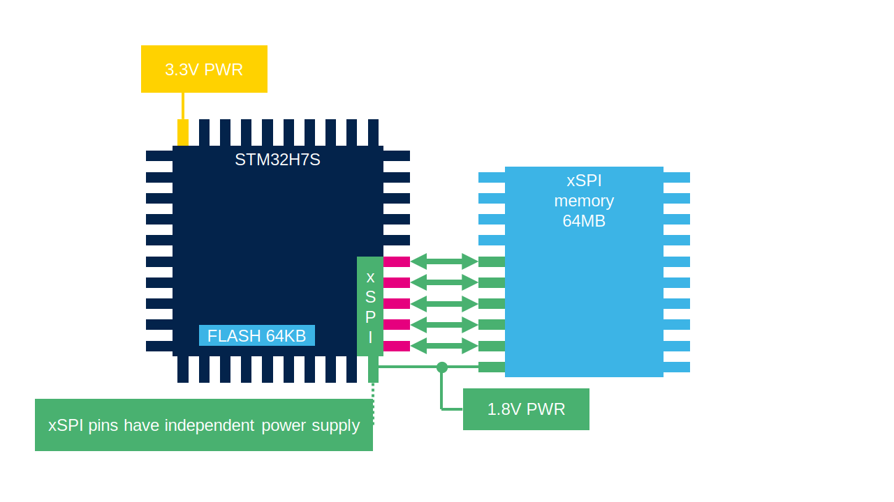
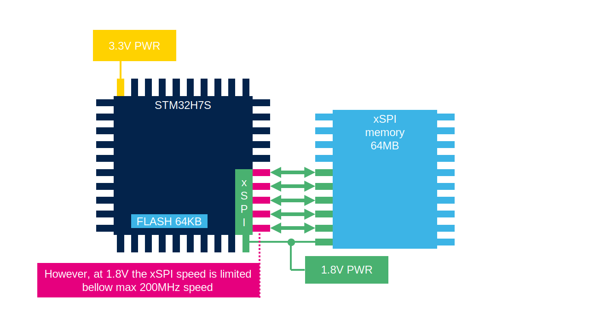
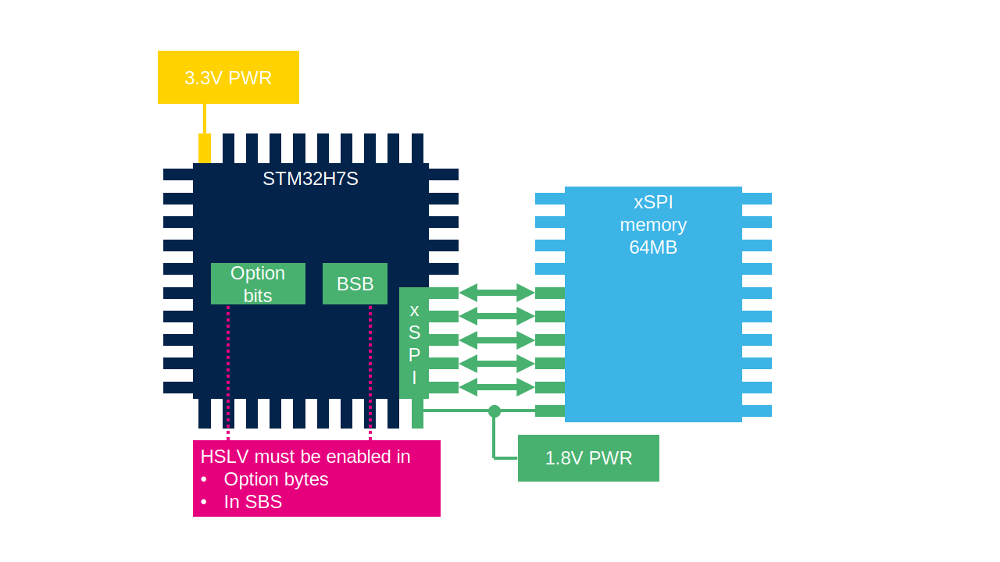
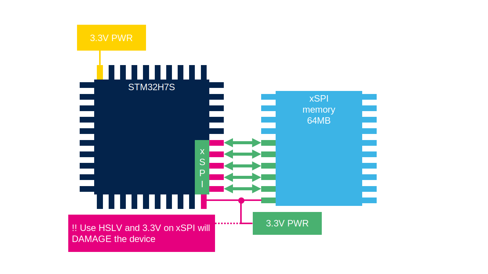
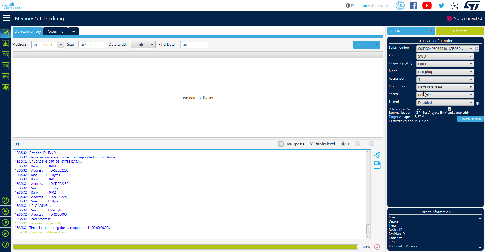

# OSPI Low voltage setup

The OSPI on the NUCLEO-H7S3L8 development board is powered by 1.8V. Normally, this would limit the speed on STM32.
However, we can enable the High Speed Low Voltage (HSLV) feature to achieve a maximum frequency of 200 MHz.

Where to enable HSLV:
- Option Bytes (can be modified using STM32CubeProgrammer)
- SBS (System configuration, Boot and Security) registers

# HSLV - High Speed Low Voltage

The xSPI1/2 have independent power domains. These domains can be powered within a range of 1.8V to 3.3V.
However to 2.6V they can run at 200 MHz. Below this frequency the speed is reduced. 
To solve this issue a HSLV feature can be enabled to allow the I/Os to run at max speed. 

This must be done in:
- SBS peripheral
- And in Option bytes

Both must be applied to have HSLV functional.

> [!CAUTION]
> If HSLV is used and power of xSPI is >2.6V it will damage the device

# STM32CubeProgrammer

1. Click to `Connect`
2. Select `Option bytes`
3. Select `User configuration 1`
4. Enable `XSPI2_HSLV`

# [CubeMX part](extmem_mx.md)
